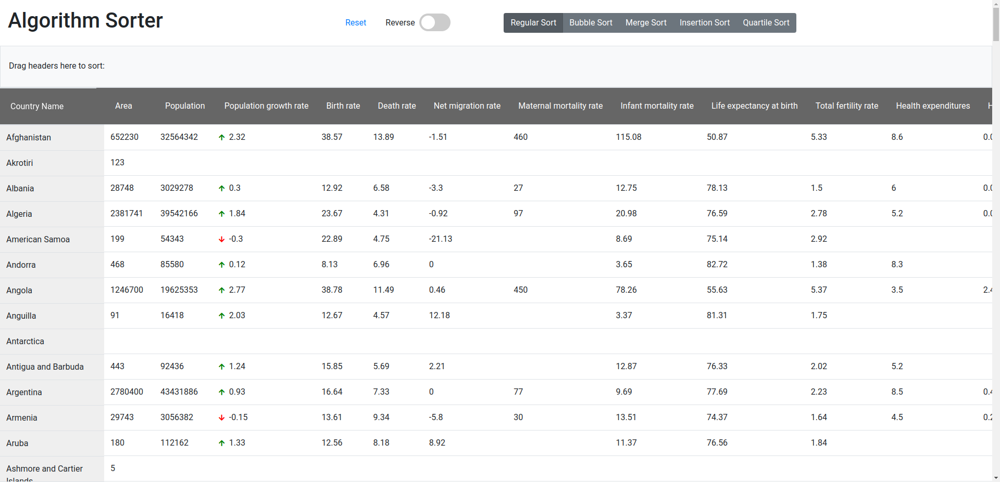

# Algorithm Sorter

> In this project, I implemented some interesting sorting algorithms and practiced optimizing code performing for these sorting algorithms.

Additional description about the project and its features.

## Built With

- JavaScript,
- HTML5,
- CSS3

## Live Demo

[Live Demo Link](https://trekab.github.io/sortable-table-and-arrays/)

## Getting Started

To get a local copy up and running follow these simple example steps.

To get a local copy up and running follow these simple example steps.
- `git clone git@github.com:trekab/sortable-table-and-arrays.git`

Then you browse to the folder and exucute the following commands
- `cd sortable-table-and-arrays`
- open the `index.html` file in your favourite browser.

## Authors

👤 **Treasure Kabareebe**

- Github: [@trekab](https://github.com/trekab)
- Twitter: [@TKabareebe](https://twitter.com/TKabareebe)
- Linkedin: [Treasure Kabareebe](https://www.linkedin.com/in/treasure-kabareebe/)

## 🤝 Contributing

Contributions, issues and feature requests are welcome!

Feel free to check the [issues page](issues/).

## Show your support

Give a ⭐️ if you like this project!

## Acknowledgments

- [LinkedIn](https://www.linkedin.com/learning/web-portfolio-projects-sortable-table-and-arrays/)

## 📝 License

This project is [MIT](lic.url) licensed.
